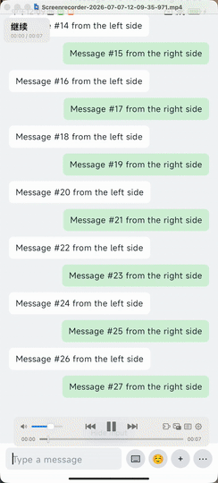

# KeyboardPanelBox

[](https://jitpack.io/#SaberArthur/KeyboardPanelBox)

[English](README.md)

<p align="center">
  
</p>

KeyboardPanelBox 是一个 Jetpack Compose 底部输入容器组件，用来协调软键盘和自定义面板。

它适合聊天页、评论输入框、编辑器，以及任何需要在输入栏下方平滑切换软键盘、表情面板、附件面板、更多操作面板的场景。

## 功能

- Compose 原生 API
- 支持通过 key 注册多个自定义面板
- 面板高度由使用方声明
- 软键盘切换到面板时平滑过渡
- 面板切换到软键盘时平滑过渡
- 内置输入框焦点和键盘控制
- 使用 `WindowInsets.ime` 追踪软键盘高度
- 使用 Android 原生 `SharedPreferences` 保存上次键盘高度
- 不假设输入栏上方的主体内容是什么

## 模块

library 模块是：

```text
:keyboardpanel
```

示例 App 模块是：

```text
:app
```

## 安装

### 本地 module 依赖

如果你直接使用当前仓库，可以这样添加 module 依赖：

```kotlin
dependencies {
    implementation(project(":keyboardpanel"))
}
```

### JitPack

```kotlin
dependencyResolutionManagement {
    repositories {
        google()
        mavenCentral()
        maven("https://jitpack.io")
    }
}
```

```kotlin
dependencies {
    implementation("com.github.SaberArthur.KeyboardPanelBox:keyboardpanel:0.1.0")
}
```

## 基本用法

`KeyboardPanelBox` 只负责底部输入区域。输入栏上方的主体内容由使用方自己管理。

```kotlin
val state = rememberKeyboardPanelState()

Column(Modifier.fillMaxSize()) {
    Box(
        modifier = Modifier
            .weight(1f)
            .fillMaxWidth()
    ) {
        MainContent()
    }

    KeyboardPanelBox(
        state = state,
        inputBar = {
            InputBar(
                modifier = Modifier.keyboardPanelInput(state),
                onKeyboardClick = { state.showKeyboard() },
                onEmojiClick = { state.showPanel("emoji") },
                onMenuClick = { state.showPanel("menu") },
                onMoreClick = { state.showPanel("more") },
            )
        },
    ) {
        panel("emoji", height = 260.dp) {
            EmojiPanel()
        }

        panel("menu", height = 200.dp) {
            MenuPanel()
        }

        panel("more", height = 240.dp) {
            MorePanel()
        }
    }
}
```

## 绑定输入框

把 `Modifier.keyboardPanelInput(state)` 挂到真正持有输入焦点的输入框上。

```kotlin
BasicTextField(
    value = text,
    onValueChange = { text = it },
    modifier = Modifier.keyboardPanelInput(state),
)
```

这样 `KeyboardPanelState.showKeyboard()` 就可以请求输入框焦点并拉起软键盘。

用户直接点击输入框时，组件状态也会同步切换到键盘模式。

## State API

```kotlin
val state = rememberKeyboardPanelState(
    defaultKeyboardHeight = 300.dp,
)
```

可用操作：

```kotlin
state.showKeyboard()
state.showPanel("emoji")
state.togglePanel("emoji")
state.hide()
```

可读状态：

```kotlin
state.mode
state.currentPanelKey
state.isKeyboardMode
state.isPanelMode
state.isVisible
state.bottomHeight
```

## Panel DSL

面板通过字符串 key 注册：

```kotlin
panel("emoji", height = 260.dp) {
    EmojiPanel()
}
```

library 不关心 `emoji`、`menu`、`more` 的业务含义。它只会把 `showPanel(key)` 传入的 key 和已注册的 panel 匹配起来，然后使用这个 panel 声明的高度和内容。

## 重要注意事项

不要给 `KeyboardPanelBox` 再套 `Modifier.imePadding()`。

`KeyboardPanelBox` 内部已经使用软键盘高度作为底部区域高度。如果外层再加 `imePadding()`，键盘高度会被应用两次，导致底部区域变成双倍高度。

推荐：

```kotlin
KeyboardPanelBox(
    state = state,
    modifier = Modifier.fillMaxWidth(),
    inputBar = { ... },
) {
    panel("emoji", height = 260.dp) { ... }
}
```

避免：

```kotlin
KeyboardPanelBox(
    state = state,
    modifier = Modifier
        .fillMaxWidth()
        .imePadding(),
    inputBar = { ... },
) {
    panel("emoji", height = 260.dp) { ... }
}
```

## 切换行为

### 软键盘切换到面板

软键盘显示时打开自定义面板，底部高度会从当前键盘高度过渡到目标面板高度。

### 面板切换到软键盘

面板显示时请求软键盘，当前面板高度会先被保持住，直到软键盘高度顶上来。这样可以避免常见的“先塌陷再跳起”的切换问题。

### 面板切换到面板

从一个 panel key 切换到另一个 panel key 时，底部高度会从旧面板高度动画过渡到新面板高度。

### 隐藏

`state.hide()` 会隐藏软键盘、清除输入焦点，并收起底部区域。

## 示例

运行示例 App：

```bash
./gradlew :app:installDebug
```

或者只编译：

```bash
./gradlew :app:compileDebugKotlin
```

示例内容包括：

- 输入框焦点绑定
- 键盘按钮
- emoji 面板
- menu 面板
- more 面板
- 使用方自己管理主体内容

## 最低版本

当前模块配置为：

```kotlin
minSdk = 21
```

library 使用 Compose `WindowInsets` API，没有直接依赖 Android API 30 的平台调用。不过键盘动画在不同 Android 版本、设备、ROM 和输入法上的表现可能存在差异，建议在目标设备上做真机验证。

## License

当前还没有添加 license。发布开源仓库前请先补充 license。
